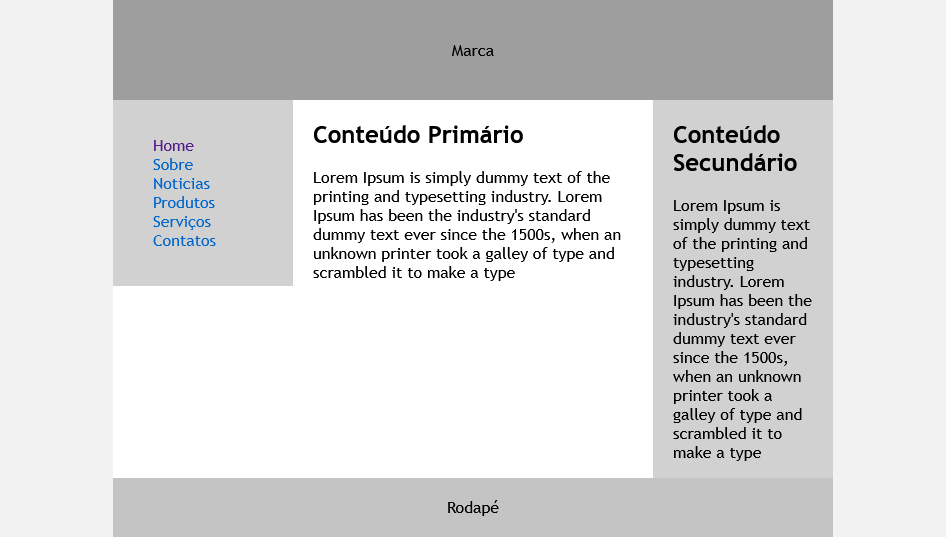
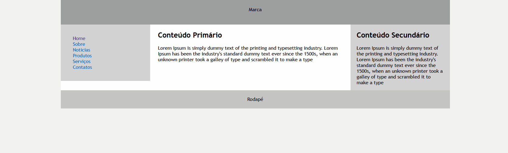
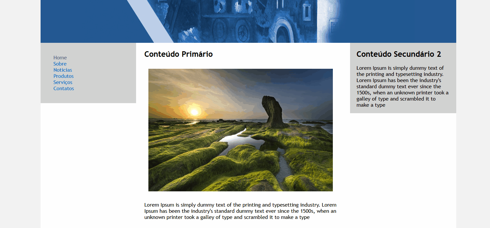

<h1 align="center">
   Layout's
</h1>

<h2 align="center">
Layout Fixa
</h2>

<h1 align="center">

<h2 align="center">
Layout Liquida
</h2>

<h1 align="center">

<h2 align="center">
Imagem Liquida
</h2>

<h1 align="center">

